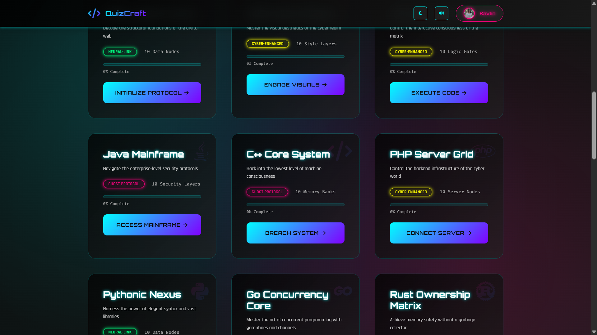

  <div align="center">
    
  </div>

<div align="center"></div>

# <div align="center">QUIZCRAFT</div>

  <div align="center">
    
  </div>

## 🧭 An Interactive Cyberpunk Quiz Platform

**QuizCraft** is a futuristic, cyberpunk-themed quiz platform where developers can test and sharpen their coding knowledge. It merges a high-energy, neon-infused aesthetic with a robust, feature-rich user experience. It's built on a foundation of vanilla web technologies, showcasing what's possible with clean code and a strong creative vision.

> “In every line of code, there's a new challenge. In every challenge, a lesson. In every lesson, mastery.”

---

### 🌌 Vision: Making Learning an Experience

Technical learning platforms are often sterile and uninspired. QuizCraft’s vision is to transform learning from a transactional task into an immersive experience. It's a space where the challenge of a quiz meets the thrill of a futuristic digital world, making the process of learning not just effective, but deeply engaging and memorable.

### The QuizCraft Difference

| Pillar | What It Means | How QuizCraft Expresses It |
|---|---|---|
| **Engagement** | Keeping users invested and motivated. | Timed questions, interactive feedback, sound effects, and a persistent analytics system that tracks growth. |
| **Aesthetics** | A beautiful and consistent visual language. | A rich cyberpunk theme with glassmorphism, neon glows, animated gradients, and custom fonts. |
| **Persistence** | Remembering user progress without a backend. | All quiz results and theme preferences are saved to the browser's Local Storage. |
| **Modularity** | Clean, manageable, and scalable code. | The logic is separated into distinct modules: a Quiz Engine, a Theme Manager, and core application logic. |

## 🚀 Live Demo

Experience QuizCraft live here: 
👉 [](https://QuizCraft-kavlin.vercel.app/)

 <div align="center">
 <p>

[](https://github.com/ellerbrock/open-source-badges/)


 </p>
 </div>

<div align="center">
  
  <br>
</div>
<div align="center">
  
  <br>
</div>

## ✨ Features 
<div align="center">
  
</div>

| Domain | Features | Status |
|---|---|---|
| **Core Quiz Engine** | Timed questions, question progress bar, score display, keyboard navigation | ✅ |
| **Quiz Navigation** | Next/Previous buttons, clickable navigation dots to jump between questions | ✅ |
| **Results & Feedback**| Comprehensive results modal with score, accuracy, time, and custom messages | ✅ |
| **UI & Theming** | Advanced multi-theme engine (6+ themes), sound toggle, futuristic aesthetic | ✅ |
| **Persistence** | User theme/sound preferences and all quiz progress saved to Local Storage | ✅ |
| **Homepage** | Cyberpunk hero section, animated stats, grid of 16+ programming quizzes | ✅ |
| **User Analytics** | "Neural Analytics" dashboard showing total score, streak, time spent, accuracy | ✅ |
| **Interactive UI** | Animated elements, loading screen, back-to-top button, interactive footer | ✅ |
| **Easter Eggs** | Hidden Konami code and other interactive secrets for users to discover | ✅ |
| **Code Structure** | Modular vanilla JS (no frameworks), component-based thinking | ✅ |
| **Future Hooks** | Architecture is ready for new quizzes, themes, and features | 🔄 Planned |
---

## 🌟 Stand-Out Experience Features

### 1. Advanced Multi-Theme Engine
QuizCraft includes a sophisticated theme manager with six distinct themes. It features a dynamically generated pop-up selector with multi-level interaction on the theme toggle button (single-click, double-click, triple-click) and keyboard shortcuts.

### 2. Fully Client-Side Persistence
Without any backend, the application tracks and displays user analytics across sessions. It reads a detailed log of all quiz attempts from Local Storage to calculate and display aggregate stats like average accuracy and total time spent.

### 3. Immersive Cyberpunk Aesthetic
The entire UI is built with a consistent and engaging visual language, featuring glassmorphism, neon glows, animated gradients, custom futuristic fonts, and subtle sound effects to create a deeply immersive experience.

### 4. Modular Vanilla JavaScript Architecture
The project is a showcase of what can be achieved with pure HTML, CSS, and JavaScript. The logic is cleanly separated into modules like a `QuizEngine`, `ThemeManager`, and a core `QuizCraft` class, making it easy to maintain and extend.

## 📺 Video Explanation

For a detailed walkthrough of QuizCraft's features and how to use them, check out this video:

**[Video Coming Soon]**

---

## 🛠️ Technologies Used


---

## ⚙️ Installation and Setup

QuizCraft is a fully client-side application and requires no build steps or package installation.

```bash
# 1. Clone the repository
git clone [https://github.com/Kavlin-Kaur/mcq-quizz.git](https://github.com/Kavlin-Kaur/mcq-quizz.git)

# 2. Navigate to the project directory
cd mcq-quizz

# 3. Open the index.html file in your browser
#    You can do this by double-clicking the file or using a live server extension
#    in your code editor.
````

---

## Issue Creation ✴
Report bugs and  issues or propose improvements through our GitHub repository.

## Contribution Guidelines 📑

<div align="center">
  
</div>

- Firstly Star(⭐) the Repository
- Fork the Repository and create a new branch for any updates/changes/issue you are working on.
- Start Coding and do changes.
- Commit your changes
- Create a Pull Request which will be reviewed and suggestions would be added to improve it.
- Add Screenshots and updated website links to help us understand what changes is all about.

- Check the [CONTRIBUTING.md](CONTRIBUTING.md) for detailed steps...
    
## Contributing is fun🧡

We welcome all contributions and suggestions!
Whether it's a new feature, design improvement, or a bug fix — your voice matters 💜

Your insights are invaluable to us. Reach out to us team for any inquiries, feedback, or concerns.

## 👥 Contributors

Thanks to these wonderful people for contributing 💖

[](https://github.com/Kavlin-Kaur/QuizCraft/graphs/contributors)

## 📄 License

This project is open-source and available under the [MIT License](LICENSE).

## 📞 Contact

Developed by [Kavlin](https://kavlin-kaur.github.io/kavres/)

Feel free to reach out with any questions or feedback\! Thanks for reading, here's a cookiepookie:

